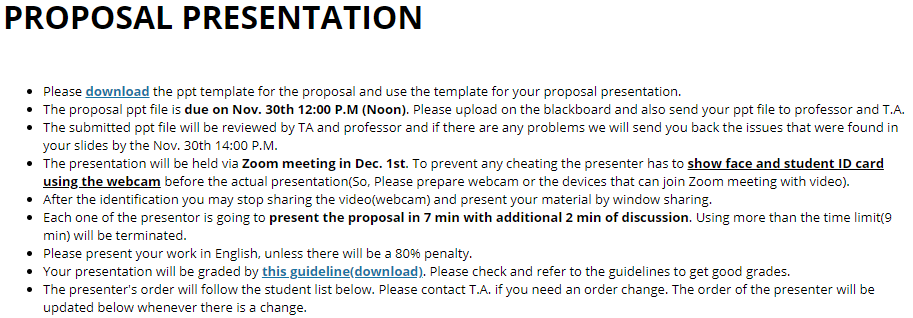
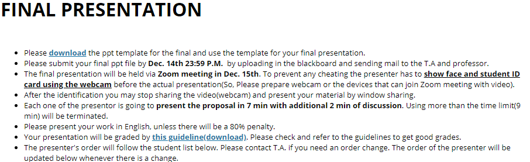
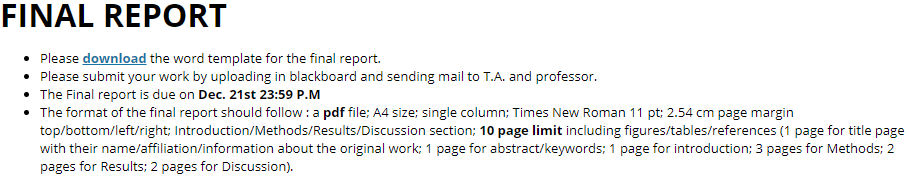
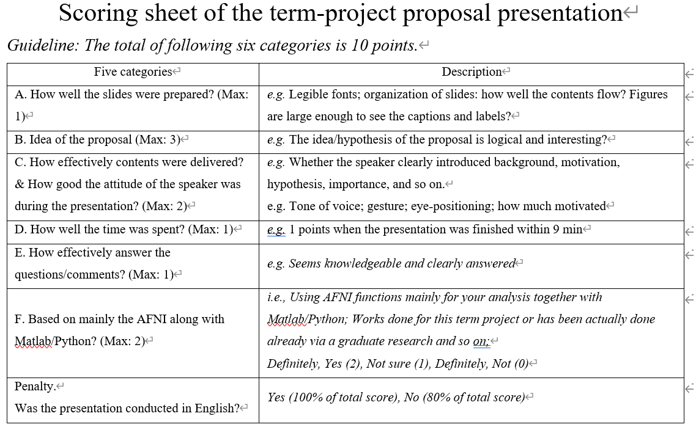
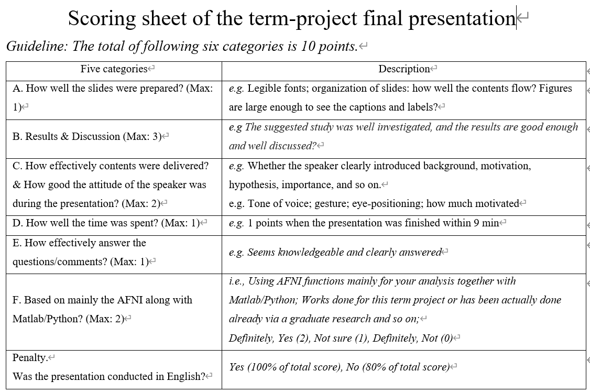

# Attend and Decode fMRI with Transformers - BRI609 Term Project(Daehyun Cho)

## Motivation
Always had in mind to anaylze fMRI data with Deep learning method. Since neuroscience, neuroimaging nurished deep learning fields in many way, I this would help in the opposite way too. Some people already took their step to this and very thankful to what they've done. :pray:   
Citation: *#sorry, never cited paper before... tell me if anything wrong here...*   
Computer Vision and Pattern Recognition [cs.CV]  
[arXiv:2004.05234](arXiv:2004.05234)(or arXiv:2004.05234v1 for this version)

## Term Project Proposal and PR Guidelines

**Score Guidelines**

